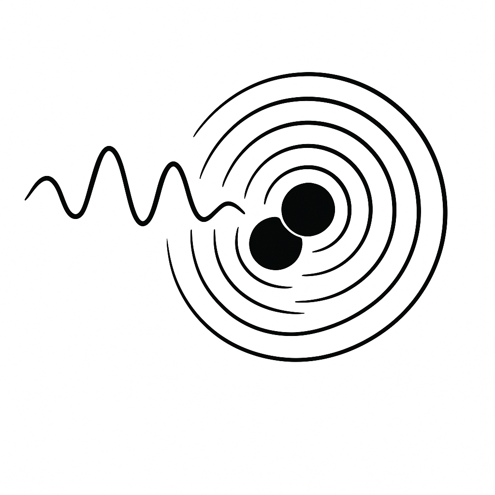

<p align="center">

</p>


# WDM_GW_wavelets

A fast, JAX-based Python implementation of the Wilson-Daubechies-Meyer (WDM) wavelet transform for the time-frequency analysis of gravitational wave data.

# Getting Started

To install clone the repository and install using pip. Run the following in the directory cotaining the pyproject.toml file.

```bash
pip install -e .
```

In Python you should then be able to `import WDM`.


# Testing

To check that everything is working as expected you can run the unit tests. 
You will first need to ensure you have `pytest` installed; this can be done by installing with the dev extras.

```bash
pip install .[dev]
```

You will then be able to run all the tests. (Make sure you are in the directory cotaining the pyproject.toml file.)

```bash
python -m pytest
```


# Documentation

Documentation is built using `sphinx`. You will first need to ensure you have this installed; this can be done by installing with the docs extras.

```bash
pip install .[docs]
```

Then build the docs by running the following make command.

```bash
cd ./docs
make clean
make html
```

The open the documentation using your browser.

``` bash
open ./docs/build/html/index.html
```
