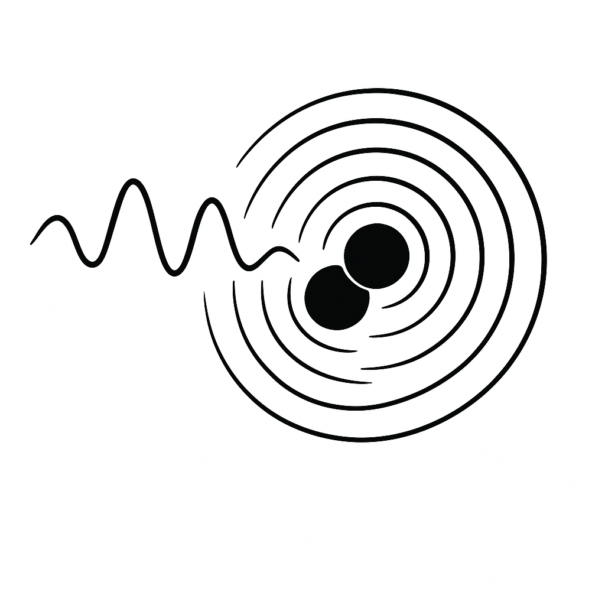

<p align="center">

</p>


# WDM_GW_wavelets

A fast, JAX-based Python implementation of the Wilson-Daubechies-Meyer (WDM) wavelet 
transform for the time-frequency analysis of gravitational wave data.

👉 https://cjm96.github.io/WDM_GW_wavelets/


# Installation

#### PyPI

This package is available on [PyPI](https://pypi.org/project/WDM-GW-wavelets/):

```bash
pip install WDM-GW-wavelets
```

#### From Source

To install the package from source, clone the repository and run the following command in the directory containing the pyproject.toml file:

```bash
pip install -e .
```

# Getting Started

In Python you should be able to `import WDM`. 
Try running the example notebook `getting_started.ipynb`.


# Documentation

The documentation for this package, including mathematical details of the WDM wavelets, is hosted on GitHub Pages:

👉 https://cjm96.github.io/WDM_GW_wavelets/

The documentation is built using `sphinx`. 
If you want to (re)build the documentation yourself you will need to ensure you have this installed; this can be done by installing with the docs extras.

```bash
pip install .[docs]
```

Build the docs by running the following command.

```bash
cd ./docs
make clean
make html
```

Open the local documentation files using your browser.

``` bash
open ./docs/build/html/index.html
```

If you need to rebuild the `sphinx` docs, then run the following command.

``` bash
cd ./docs
make clean
sphinx-build ./source ./build
make html
```


# Testing

To check that everything is working as expected you can run the unit tests. 

The tests are run with `pytest`. 
You will first need to ensure you have this installed; this can be done by installing with dev extras.

```bash
pip install .[dev]
```

You will then be able to run all the tests. 
(Make sure you are in the directory cotaining the pyproject.toml file.)

```bash
python -m pytest
```


# Authors

- Christopher J. Moore
- Tomasz Kinowski
