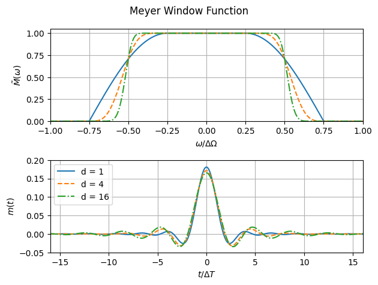
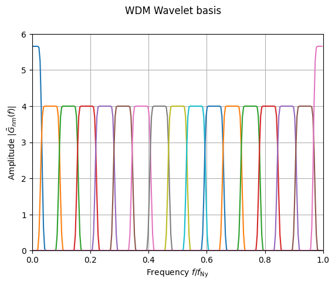
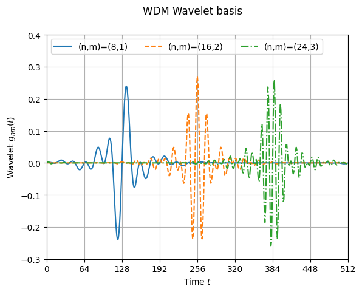
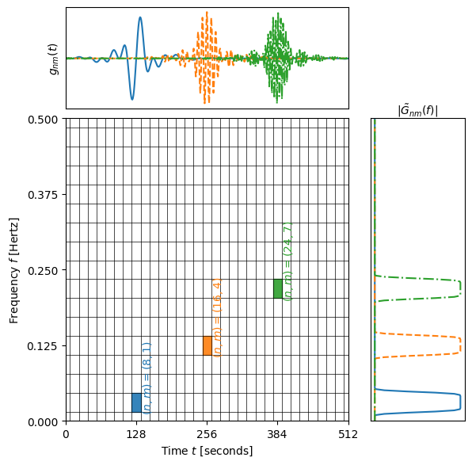
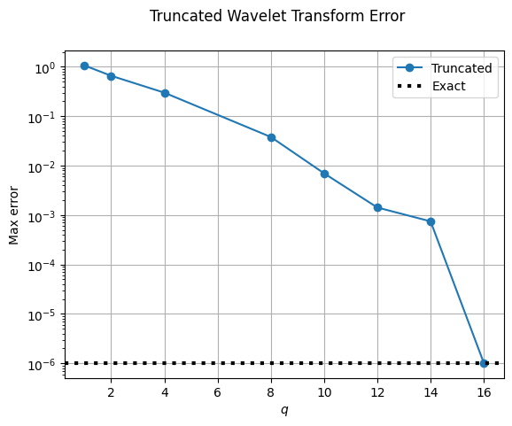
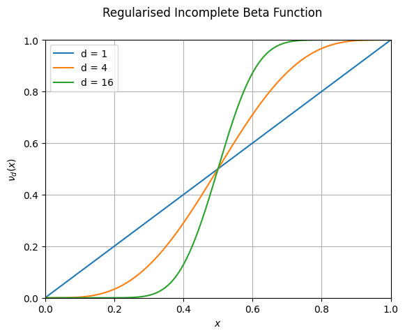

=======================
Mathematical Background
=======================

This section describes the mathematical background to the WDM wavelet transform.

.. contents::
   :local:

Introduction
------------

The Wilson-Daubechies-Meyer (WDM) wavelet basis is widely used for gravitational wave (GW) data analysis.
While far from being the only available choice, the WDM basis wavelets have severa; properties that make 
them well suited for this purpose: they are well separated in frequency (in fact, they have
compact support) which helps connect with the rest of GW data analysis which is almost exclusively done 
in the frequency domain, and they provide a uniform tiling in both time and frequency.
The WDM wavelets were first introduced for GW data analysis in Ref. [1]_ (see also Ref. [2]_) and are used 
in Coherent WaveBurst (CWB; Refs. [3]_ and [4]_).

This document is based heavily on Refs. [1]_ and [2]_ with only a few minor changes in notation and conventions
The purpose of this document is to provide a complete self-contained description of the WDM wavelet 
transform to accompany this Jax implementation while spelling out explicitly as many of the details as possible 
and correcting a few minor typos in the literature.

Fourier Transform Conventions
-----------------------------

Here the following Fourier transform conventions are used:

.. math:: 

   \tilde{X}(f) = \int_{-\infty}^{\infty} \mathrm{d}t\; \exp(-2\pi ift) x(t) ,

.. math:: 

   x(t) = \int_{-\infty}^{\infty} \mathrm{d}f\; \exp(2\pi ift) \tilde{X}(f) .

For discretely sampled time series 

Meyer Window
------------

The WDM wavelet transform is based on the Meyer window function, which is 
defined in the frequency domain by

.. math::

    \tilde{M}(\omega) = \begin{cases}
        \sqrt{\frac{1}{\Delta\Omega}} & \text{if } |\omega| < A, \\
        \sqrt{\frac{1}{\Delta\Omega}}  \cos\left(\frac{\pi}{2}\nu_d\left(\frac{|\omega| -
         A}{B}\right)\right) & \text{if } A \leq |\omega| \leq A + B \\
        0 & \text{if } |\omega| > A + B
    \end{cases} ,

where :math:`A>0` and :math:`B>0` control the shape of the window.
The parameter :math:`A` is the half-width of the flat-top response region and :math:`B` is the width of the transition region;
they satisfy :math:`2A + B = \Delta\Omega`, where :math:`\Delta\Omega` is the total wavelet bandwidth.
See :numref:`fig-Meyer_window`.

.. _fig-Meyer_window:

   *Top*: The Meyer window function :math:`\tilde{M}(\omega)` for different values of :math:`d`.
   *Bottom* the time-domain window :math:`m(t)`, where :math:`\Delta T = \pi/\Delta \Omega`. 
   The case :math:`d=4` matches Fig.1 of Ref. [2]_.
   Note how the wavelet is well localised in frequency (with compact support) but much less so in time.

The Meyer window function has the property that its square integrates to 1.
To show this, first integrate over the flat-top part of the window (line 1), 
then let :math:`x=(\omega-A)/B` (line 2), then use :math:`\cos^2 \theta = \frac{1+\cos(2\theta)}{2}` (line 3),
and finally use the symmetry :math:`\cos(\pi \nu_d(1-x))=\cos(\pi (1-\nu_d(x))) = \cos(\pi-\pi\nu_d(x)))= -\cos(\pi \nu_d(x))`
to set the remaining piece of the integral to zero (line 4):

.. math::

   \begin{align}
   \int_{-\infty}^{\infty} \mathrm{d}\omega\; |\tilde{M}(\omega)|^2 &= 
      \frac{2A+2\int_{A}^{A+B} \mathrm{d}\omega\; \cos^2\left(\frac{\pi}{2}\nu_d(\frac{\omega-A}{B})\right)}{2A+B}  , \\
      &= \frac{2A+2B \int_0^1 \mathrm{d}x\; \cos^2\left(\frac{\pi}{2}\nu_d(x)\right)}{2A+B} , \\
      &= \frac{2A+2B \left(\frac{B}{2}+\frac{B}{2}\int_0^1\mathrm{d}x\; \cos\left(\pi\nu_d(x)\right)\right)}{2A+B} , \\
      &= 1.
   \end{align}

The function :math:`M(\omega)` is implemented in :func:`WDM.code.utils.Meyer.Meyer`.

Henceforth, we will work with frequency :math:`f` instead of angular frequency :math:`\omega=2\pi f`. 
This fits with the rest of the GW data analysis community which generally uses :math:`f`.

For the wavelet transform, the frequency-domain window function is defined to be 

.. math::
   
   \tilde{\Phi}(f) = \sqrt{2\pi} M(2\pi f) ,

and the corresponding time-domain window is 

.. math:: 
   
   \phi(t) = \int \mathrm{d}f \; \exp(2\pi i ft) \tilde{\Phi}(f)

These are implemented in 
:func:`WDM.code.discrete_wavelet_transform.WDM.WDM_transform.build_frequency_domain_window` and
:func:`WDM.code.discrete_wavelet_transform.WDM.WDM_transform.build_time_domain_window`.

Unless otherwise stated, the default values :math:`A=\Delta \Omega/4`, :math:`B=\Delta \Omega/2`, and 
:math:`d=4` will be used throughout the rest of this document.

WDM Wavelets
------------

Consider a function of time :math:`x(t)`. 
The discretely sampled time series :math:`x[k]=x(t_k)` is indexed by :math:`k\in\{0, 1, \ldots, N-1\}` 
and evaluated at the sample times :math:`t_k=k\delta t`, where :math:`\delta t` is the cadence and 
:math:`f_s = \frac{1}{\delta t}` is the sampling frequency.
The total duration of the time series is :math:`T=N\delta t`, 
and the maximum Nyquist frequency is :math:`f_{\rm Ny}=\frac{1}{2\delta t}`.
The frequency resolution is :math:`\delta f = \frac{1}{T}`.

The WDM wavelet transformation represents the time series using :math:`N_f` frequency slices of with :math:`\Delta F`
and :math:`N_t` time slices of width :math:`\Delta T`; 

.. math::

   \Delta T = N_f \delta t ,

.. math::

   \Delta F = \frac{1}{2 N_f \delta t} = \frac{N_t}{2T} .

There are :math:`N=N_t N_f` cells, each with area :math:`\Delta T \Delta F = \frac{1}{2}`.
Together, these cells uniformly tile the time–frequency plane.
We will insist that :math:`N_t` and :math:`N_f` are both even, which means that :math:`N` is also even;
although this isn't strictly necessary, it simplifies some formulae and is not a significant limitation in practice.

The WDM wavelets :math:`g_{nm}(t)` are constructed from the Meyer window function :math:`\phi`. 
The indices :math:`n` and :math:`m` label the time and frequency slices respectively.
In the time-domain an orthonormal Wilson wavelet basis (Refs. [5]_ and [6]_) can be defined as

.. math::

   g_{nm}(t) = \begin{cases}
        \phi(t-2n\Delta T) & \mathrm{if}\;m=0 \\
        \begin{cases}
            \sqrt{2} (-1)^{mn} \cos\left(\frac{\pi m t}{\Delta T}\right) \phi(t-n\Delta T) & \mathrm{if}\;n+m\;\mathrm{even}\\
            \sqrt{2} \sin\left(\frac{\pi m t}{\Delta T}\right) \phi(t-n\Delta T) & \mathrm{if}\;n+m\;\mathrm{odd}
        \end{cases} & \mathrm{if}\;m>0 
        \end{cases} .

Taking the Fourier transform, it is straightforward to show that the frequency-domain basis wavelets are given by

.. math::

    \tilde{G}_{nm}(f) = \begin{cases}
        \exp(-4\pi i n f \Delta T) \tilde{\Phi}(f) & \mathrm{if}\;m=0 \\
        \frac{\exp(-2\pi i n f \Delta T)}{\sqrt{2}} \left( C_{nm}\tilde{\Phi}(f+m\Delta F)
        +C^*_{nm}\tilde{\Phi}(f-m\Delta F) \right) & \mathrm{if}\;m>0 
    \end{cases} ,

where 

.. math::

   C_{nm} = \begin{cases} 1 & \mathrm{if}\;n+m\;\mathrm{even} \\ 
                          i & \mathrm{if}\;n+m\;\mathrm{odd} \end{cases} .

The time index :math:`n\in\{0,1,\ldots,N_t-1\}` covers the whole range of time.
However, the frequency index in the range :math:`m\in\{0,1,\ldots, N_f\}` (including :math:`N_f`) 
gives wavelets that remain below the Nyquist frequency (see :numref:`fig-WDM_wavelets_FD`). 
The case :math:`m=N_f` is handled as a special case using the following formulae;

.. math::

   g_{nN_f}(t) = 2\cos(2\pi f_{\rm Ny}[t-2n\Delta T]) \phi(t-2n\Delta T),

.. math::

   \tilde{G}_{nN_f}(f) = \exp(-4\pi i n f \Delta T) \left( \tilde{\Phi}(f-f_{\rm Ny}) + \tilde{\Phi}(f+f_{\rm Ny}) \right) .

Notice that for most of the wavelets the index :math:`n` shifts the wavelets by integer multiples of :math:`\Delta T` in time.
However, for :math:`m=0` and :math:`m=N_f` it shifts them by integer multiples of :math:`2\Delta T`.

The WDM wavelets are plotted in the frequency domain in :numref:`fig-WDM_wavelets_FD`.

.. _fig-WDM_wavelets_FD:

   The :math:`d=4` WDM wavelets :math:`|\tilde{G}_{nm}(\omega)|` plotted in the frequency domain for 
   :math:`m=0, 1, 2,\ldots,N_f`. 
   Wavelets computed using :math:`N_f=16` are shown to match Fig.2 of Ref. [1]_.

As defined, the index :math:`m` takes on both values 0 and :math:`N_f`.
However, these two cases can be conveniently grouped together.
Because of the :math:`2\Delta T` time shift, only half of the :math:`n` range is needed;
therefore, we redefine :math:`G_{n0}(f):=G_{nN_f}(f)` when :math:`n>N_t/2`.
With this choice, the index ranges :math:`n\in\{0,1,\ldots,N_t-1\}` and :math:`m\in\{0,1,\ldots,N_f-1\}`
cover the entire time-frequency plane; see :numref:`fig-WDM_wavelets_animate`.
The central time and frequency of the wavelet :math:`g_{nm}(t)` are given by

.. math::

   t_{nm} = \begin{cases} 2 n \Delta T & \mathrm{if}\;m=0 \\
                     n \Delta T & \mathrm{if}\;m>0 \end{cases} \,,

.. math::

   f_{nm} = \begin{cases} \begin{cases}0&\mathrm{if}\;n<N_t/2\\
                           f_{\rm Ny}&\mathrm{if}\,n\geq N_t/2\end{cases} & \mathrm{if}\;m=0 \\
                     m \Delta F & \mathrm{if}\;m>0 \end{cases} \,.

These expressions are implemented in 
:func:`WDM.code.discrete_wavelet_transform.WDM.WDM_transform.wavelet_central_time_frequency`. 

Examples of the WDM wavelets with :math:`N=512`, :math:`N_f=16`, and :math:`\delta t=1`
are shown in :numref:`fig-WDM_wavelets_TD`, :numref:`fig-WDM_wavelets_TF`, and :numref:`fig-WDM_wavelets_animate`.
Notice that the WDM wavelets are well localised in frequency but much less so in time.

.. _fig-WDM_wavelets_TD:

   The time-domain WDM wavelets :math:`g_{nm}(t)` for selected values of :math:`n` and :math:`m`.

.. _fig-WDM_wavelets_TF:

   The WDM wavelets plotted in the time (top) and frequency (right) domains for selected values of :math:`n` and :math:`m`.
   The main plot shows a grid of time-frequency shaded to indicate where the wavelets have significant support.

.. _fig-WDM_wavelets_animate:

.. figure:: ../figures/wavelet_animation.gif
   :alt: wavelet_animation
   :align: center
   :width: 90%

   Animated version of :numref:`fig-WDM_wavelets_TF` looping through all the wavelets. 
   Notice in particular the behaviour of the wavelets for :math:`m=0`.

The discretely sampled WDM wavelets have the following orthonomality properties:

.. math::

   \delta t \sum_{k=0}^{N-1} g_{nm}[k] g_{n'm'}[k] = \delta_{nn'} \delta_{mm'} .

.. math::

   \delta f \sum_{k=-N/2}^{N/2-1} \tilde{G}_{nm}[k] \tilde{G}^*_{n'm'}[k] = \delta_{nn'} \delta_{mm'} .

The frequency-domain WDM wavelets :math:`\tilde{G}_{nm}(f)` are implemented in 
:func:`WDM.code.discrete_wavelet_transform.WDM.WDM_transform.Gnm` or 
:func:`WDM.code.discrete_wavelet_transform.WDM.WDM_transform.Gnm_basis`.

The time-domain WDM wavelets :math:`g_{nm}(t)` are implemented in 
:func:`WDM.code.discrete_wavelet_transform.WDM.WDM_transform.gnm` or 
:func:`WDM.code.discrete_wavelet_transform.WDM.WDM_transform.gnm_basis`.

The Discrete Wavelet Transform
------------------------------

This section defines the discrete WDM wavelet transform, present its exact formulation, and describe a 
computationally efficient implementation suitable for practical use.

The WDM wavelets form a complete orthonormal basis for discretely sampled time series,

.. math::

   x[k] = \sum_{n=0}^{N_t-1} \sum_{m=0}^{N_f-1} w_{nm} g_{nm}[k] .

Here, :math:`x[k]` is the input time series, :math:`w_{nm}` are the wavelet coefficients, and :math:`g_{nm}[k]` are the 
WDM wavelet basis function.

An expression for the wavelet coefficients :math:`w_{nm}` can be derived by multiplying both sides of this
equation by :math:`g_{n'm'}[k]`, summing over :math:`k`, and using the orthonormality property to obtain

.. math::

   w_{nm} = 2\pi \delta t\sum_{k=0}^{N-1} x[k] g_{nm}[k] .

This is the exact expression for the forward wavelet transform which transforms from the time 
to the time-frequency domain. 

This *exact* wavelet transform is implemented in
:func:`WDM.code.discrete_wavelet_transform.WDM.WDM_transform.forward_transform_exact`.

The exact form of the wavelet transform described above is slow to implement.
A practical improvement arises from the observation that the WDM are (approximately) localised in time
and the sum over :math:`k` can be truncated to a window of length :math:`K=2qN_f` without significant loss of accuracy.
The truncation parameter :math:`1\leq q\leq N_t/2` is a positive integer that controls the length of the window.
The truncated wavelet transform is given by

.. math::

   w_{n0} = 2\pi\delta t\sum_{k=-K/2}^{K/2-1} 
                                    g_{nm}[k + 2 n N_f] x[k + 2 n N_f] ,

.. math::

   w_{nm} = 2\pi\delta t\sum_{k=-K/2}^{K/2-1} 
                                    g_{nm}[k + n N_f] x[k + n N_f] 
                                    \quad \mathrm{for} \; m>0.  

This form of the *truncated* wavelet transform is implemented in
:func:`WDM.code.discrete_wavelet_transform.WDM.WDM_transform.forward_transform_truncated`.

Smaller values of :math:`q` yield faster but less accurate results, see :numref:`fig-trunc_err`.

.. _fig-trunc_err:

   The error in the truncated wavelet transform as a function of :math:`q`.
   The wavelet transform is applied to a white-noise time series with :math:`\mathrm{rms}=1`.
   The error is defined as the maximum relative absolute difference between the original signal and 
   that reconstructed signals from the truncated wavelet transform. 
   For :math:`q=N_t/2=16`, there is no truncation and the result agrees with the exact transform.

The truncated wavelet transform can be rewritten in terms of the window function :math:`\phi[k]`

.. code-block:: python

   f = jnp.fft.fftfreq(N, d=dt) 
   Phi = Meyer(2.*jnp.pi*f, d, A, B)
   phi = jnp.fft.ifft(Phi).real

This window is created using
:func:`WDM.code.discrete_wavelet_transform.WDM.WDM_transform.build_time_domain_window`.

Using the definition of the WDM wavelets, the truncated wavelet transform can be written as

.. math::

   w_{nm} = 2\sqrt{2}\pi\delta t \mathrm{Re} \sum_{k=-K/2}^{K/2-1} 
                            C_{nm} \exp(i\pi km/N_f) 
                            x[k+nN_f] \phi[k] \quad \mathrm{for}\; m>0,

.. math::

   w_{n0} = 2\pi\delta t\sum_{k=-K/2}^{K/2-1} 
                            x[k+2nN_f] \phi[k] \quad \mathrm{for}\; n<N_t/2,

.. math::

   w_{n0} = 2\pi\delta t\sum_{k=-K/2}^{K/2-1} (-1)^k x[k+2nN_f]
                            \phi[k] \quad \mathrm{for}\; n\geq N_t/2.

This form of the *truncted, window* wavelet transform using :math:`\phi[k]` is implemented in
:func:`WDM.code.discrete_wavelet_transform.WDM.WDM_transform.forward_transform_window`.

The greatest computational speed up comes from writing the truncated wavelet transform in terms of the
the windowed Fast Fourier Transform (FFT).
The windowed FFT is defined as

.. math::

   X_n[j] = \sum_{k=-K/2}^{K/2-1} \exp(2\pi i kj/K) x[nN_f+k] \phi[k] ,

where the index :math:`j` runs over a range :math:`K`.

The *windowed FFT* (with these index and sign conventions) is implemented in
:func:`WDM.code.discrete_wavelet_transform.WDM.WDM_transform.windowed_fft`

Using the windowed FFT, the truncated wavelet transform can be written as

.. math::

   w_{nm} = 2\pi \sqrt{2} \delta t \mathrm{Re} C_{nm} X_n[mq] , \quad \mathrm{for} \; m>0.

I.e., the wavelet transform can be computed using the windowed FFT of the time series downsampled to 
every :math:`q^{\rm th}` coefficient.

This expression only holds for :math:`m>0`.
If the :math:`m=0` terms are required, they can be computed using the above truncted-window wavelet transform expressions.
However, in many applications the :math:`m=0` terms are not needed anyway.

This *windowed FFT* form of the truncted wavelet transform is implemented in
:func:`WDM.code.discrete_wavelet_transform.WDM.WDM_transform.forward_transform_truncated_windowed_fft`.
If the :math:`m=0` terms are required, pass the argument ``m0=True`` to this function.

This windowed FFT form of the truncated wavelet transform is much more efficient.
However, a small further improvement is possible by using the fact that the WDM wavelets 
are more compact in the frequency domain than in the time domain.
It is slightly faster to compute the transform using the FFT of the full original time series. 

Units 
-----

The time-domain wavelets have dimension :math:`\big[g_{nm}\big]=\sqrt{1/\mathrm{time}}` and 
the frequency-domain wavelets have dimension :math:`\big[\tilde{G}_{nm}\big]=\sqrt{\mathrm{time}}`.

If the time series :math:`x(t_k)=x[k]` has dimension :math:`\big[x\big]=\alpha` 
then the wavelet coefficients have dimension :math:`\big[w_{nm}\big]=\alpha\sqrt{\mathrm{time}}`.

 
Glossary 
--------

- :math:`t`: Time (e.g. seconds).
- :math:`f`: Frequency (e.g. Hertz).
- :math:`\omega`: Angular frequency (radians per unit time). Defined as :math:`\omega=2\pi f`.
- :math:`\delta t`: Time series cadence (time units). Named ``dt`` in :func:`WDM_transform <WDM.code.discrete_wavelet_transform.WDM.WDM_transform>`. 
- :math:`f_{\rm Ny}`: Nyquist frequency, or the maximum frequency (frequency units). Defined as :math:`f_{\rm Ny}=\frac{1}{2 \delta t}`. Named ``f_Ny`` in :func:`WDM_transform <WDM.code.discrete_wavelet_transform.WDM.WDM_transform>`. 
- :math:`A`: With of flat-top response in the Meyer window (radians per unit time). Named ``A`` in :func:`WDM_transform <WDM.code.discrete_wavelet_transform.WDM.WDM_transform>`. 
- :math:`B`: With of transition region in the Meyer window (radians per unit time). Named ``B`` in :func:`WDM_transform <WDM.code.discrete_wavelet_transform.WDM.WDM_transform>`. 
- :math:`\Delta \Omega`: Angular frequency resolution of the wavelets (radians per unit time). Satisfies :math:`\Delta \Omega = 2A + B`. Named ``dOmega`` in :func:`WDM_transform <WDM.code.discrete_wavelet_transform.WDM.WDM_transform>`. 
- :math:`\Delta F`: Frequency resolution of the wavelets (frequency units). Satisfies :math:`\Delta F = \frac{\Delta \Omega}{2\pi}`. Named ``dF`` in :func:`WDM_transform <WDM.code.discrete_wavelet_transform.WDM.WDM_transform>`. 
- :math:`\Delta T`: Time resolution of the wavelets (time units). Satisfies :math:`\Delta T \Delta F= \frac{1}{2}`. Named ``dT`` in :func:`WDM_transform <WDM.code.discrete_wavelet_transform.WDM.WDM_transform>`. 
- :math:`d`: Steepness parameter for the Meyer window. Named ``d`` in :func:`WDM_transform <WDM.code.discrete_wavelet_transform.WDM.WDM_transform>`. 
- :math:`q`: Truncation parameter for the Meyer window. Named ``q`` in :func:`WDM_transform <WDM.code.discrete_wavelet_transform.WDM.WDM_transform>`. 
- :math:`N_f`: Number of frequency bands for the wavelets. Named ``Nf`` in :func:`WDM_transform <WDM.code.discrete_wavelet_transform.WDM.WDM_transform>`. 
- :math:`N_t`: Number of time bands for the wavelets, must be even. Named ``Nt`` in :func:`WDM_transform <WDM.code.discrete_wavelet_transform.WDM.WDM_transform>`. 
- :math:`N`: Number of points in the time series. Satisfies :math:`N = N_t N_f`. Named ``N`` in :func:`WDM_transform <WDM.code.discrete_wavelet_transform.WDM.WDM_transform>`.
- :math:`T`: Duration of the time series (time units). Satisfies :math:`T = N \delta t`. Named ``T`` in :func:`WDM_transform <WDM.code.discrete_wavelet_transform.WDM.WDM_transform>`.
- :math:`n`: Time index for the wavelets. In the range :math:`n\in\{0,1,\ldots, N_t-1\}`.
- :math:`m`: Frequency index for the wavelets. In the range :math:`m\in\{0,1,\ldots, N_f\}`.
- :math:`x[k]`: Time series data, where :math:`k\in\{0,1,\ldots,N-1\}` indexes the time.
- :math:`\tilde{\Phi}(\omega)`: Meyer window function.
- :math:`\phi(t)`: Time-domain Meyer window, defined as the inverse Fourier transform of :math:`\tilde{\Phi}(\omega)`.
- :math:`\tilde{G}_{nm}(\omega)`: Frequency-domain WDM wavelet.
- :math:`g_{nm}(t)`: Time-domain WDM wavelet, defined as the inverse Fourier transform of :math:`\tilde{G}_{nm}(\omega)`.
- :math:`w_{nm}`: The wavelet coefficients.
   

References
----------

.. [1] V. Necula, S. Klimenko & G. Mitselmakher, *Transient analysis with fast Wilson-Daubechies time-frequency transform*, Journal of Physics: Conference Series 363 012032, 2012.  
       `DOI 10.1088/1742-6596/363/1/012032 <https://iopscience.iop.org/article/10.1088/1742-6596/363/1/012032>`_

.. [2] N. J. Cornish, *Time-Frequency Analysis of Gravitational Wave Data*, Physical Review D 102 124038, 2020.  
       `arXiv:2009.00043 <https://arxiv.org/abs/2009.00043>`_

.. [3] S. Klimenko, S. Mohanty, M. Rakhmanov & G. Mitselmakher, *Constraint likelihood analysis for a network of gravitational wave detectors*, Physical Review D 72, 122002, 2005.
       `arXiv:gr-qc/0508068 <https://arxiv.org/abs/gr-qc/0508068>`_

.. [4] S. Klimenko *et al.*, *Method for detection and reconstruction of gravitational wave transients with networks of advanced detectors*, Physical Review D 93, 042004, 2016.
       `arXiv:1511.05999 <https://arxiv.org/abs/1511.05999>`_

.. [5] K. G. Wilson, *Generalized Wannier functions*, preprint, Cornell University.
       `link <https://>`_

.. [6] I. Daubechies, S. Jaffard & J. L. Journé, *A simple Wilson orthonormal basis with exponential decay*, SIAM Journal on Mathematical Analysis, 22, 2, 554-572, 1991.
       `DOI 10.1137/0522035 <https://doi.org/10.1137/0522035>`_

Appendices
----------

Normalised Incomplete Beta Function
===================================

The WDM wavelets use the normalised incomplete beta function, :math:`\nu_d(x)`,

.. math::

   \nu_d(x) = \frac{ \int_0^x \mathrm{d}t \, t^{d-1} (1 - t)^{d-1} }
                         { \int_0^1 \mathrm{d}t \, t^{d-1} (1 - t)^{d-1} } ,
                         \quad \mathrm{for}\; 0\leq x\leq 1.

This acts as a smooth transition function (or compact sigmoid-like function) from 0 to 1.
The parameter :math:`d` controls the steepness of the transition; see :numref:`fig-norm_incomplete_beta`.

The function :math:`\nu_d(x)` is implemented in :func:`WDM.code.utils.Meyer.nu_d`.

.. _fig-norm_incomplete_beta:

   The normalised incomplete beta function :math:`\nu_d(x)` for several values of :math:`d`.