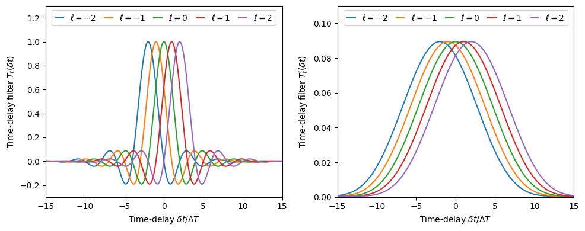
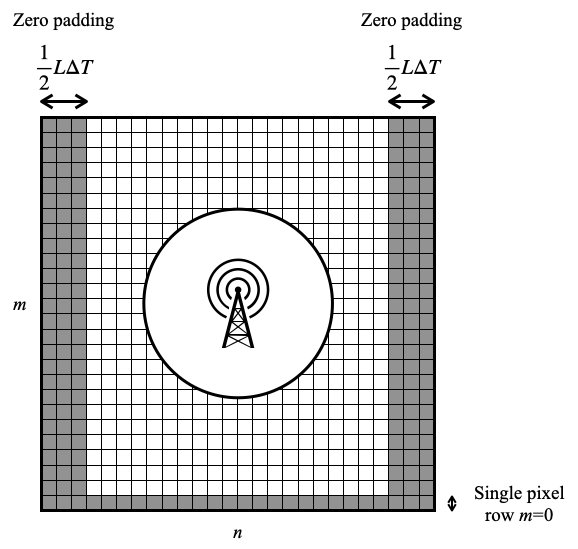

==================
Time-Delay Filters
==================

This section describes the time shift properties of the WDM wavelets. 
This is based on the results in section 4 of Ref. [1]_ .

.. contents::
   :local:

Introduction
------------

The WDM wavelets :math:`\{g_{nm}(t)|n\in\{0,1,\ldots,N_t-f\}, m\in\{0,1,\ldots,N_f-1\}\}` 
form a complete orthonormal basis, meaning that any time series can be expanded in terms 
of these wavelets. 
In particular, if we take a single wavelet and shift it in time, :math:`g_{nm}(t+\delta t)` 
we can rexpand this in terms of the original, unshifted wavelet basis.
The coefficients of this expansion are given by the overlap integrals

.. math::
    
    X_{nn';mm'}(\delta t) = \int \mathrm{d}t \, g_{nm}(t+\delta t) g_{n'm'}(t) . 

These coefficients are called the time-delay matrix elements.
They can be written as an integral over frequency; 

.. math::
    
    X_{nn';mm'}(\delta t) = \int \mathrm{d}f \, \exp(-2\pi i f\delta t) \tilde{G}^*_{nm}(f) \tilde{G}_{n'm'}(f) .

Most of the :math:`X_{nn';mm'}(\delta t)` coefficients are zero because the wavelets 
:math:`\tilde{G}_{nm}(f)` have compact support in the frequency domain and the integral 
will vanish unless the wavelets overlap.
The only non-zero coefficients are those for which :math:`m'=m` or :math:`m'=m\pm 1`.
In the general case when :math:`m\neq 0` and :math:`m'\neq 0`, these integrals evaluate 
to give (the following results are derived in the section below)

.. math::
    
    X_{nn';mm}(\delta t) = \mathrm{Re} \bigg\{ (-1)^{(n-n')m} \exp(2\pi i m \Delta F \delta t) 
                            C^*_{nm} C_{n'm} T_{n-n'}(\delta t) \bigg\} , 

.. math::

    X_{nn';m(m\pm 1)}(\delta t) = \mathrm{Re} \bigg\{ (-1)^{(n-n')m} (\mp i)^{n-n'} 
                            \exp\left(2\pi i \left(m\pm\frac{1}{2}\right) \Delta F \delta t\right) 
                            C^*_{nm} C_{n'(m\pm 1)} T'_{n-n'}(\delta t) \bigg\} ,

where the time-delay filters :math:`T_{\ell}(\delta t)` and :math:`T'_{\ell}(\delta t)` are
defined as

.. math::
    
    T_{\ell}(\delta t) = \int \mathrm{d}f \, \exp(2\pi i f (\ell \Delta T - \delta t)) |\tilde{\Phi}(f)|^2 , 

.. math::
    
    T'_{\ell}(\delta t) = \int \mathrm{d}f \, \exp(2\pi i f (\ell \Delta T - \delta t)) 
                        \tilde{\Phi}\left(f-\frac{1}{2}\Delta F\right)\tilde{\Phi}\left(f+\frac{1}{2}\Delta F\right) .

The time-delay filters :math:`T_{\ell}(\delta t)` and :math:`T'_{\ell}(\delta t)` are implemented in 
:func:`WDM.code.time_delay_filters.filters.time_delay_filter_Tl_reference` and
:func:`WDM.code.time_delay_filters.filters.time_delay_filter_Tprimel_reference` respectively.

The time-delay filters satisfy 

.. math::

    T_{\ell}(\delta+\Delta T) = T_{\ell-1}(\delta) ,

and similarly for :math:`T'_{\ell}(\delta)`. 
This property is important as is means that the filters only need to be 
interpolated in the range :math:`-\Delta T/2 \leq \delta < \Delta T/2`.
In this range the filters satisfy

.. math::

    T_l(\delta) \rightarrow 0 \quad \mathrm{as} \quad |l| \rightarrow \infty ,

and similarly for :math:`T'_l(\delta)`.
This is also important as is means that the filters are only needed for 
:math:`|l|\leq L`, where :math:`L`` is the max lag index.
These properties can both be seen in the figure below.

.. _fig-time_delay-filters:

   The time-delay filter functions :math:`T_\ell(\delta t)` (left) and 
   :math:`T'_\ell(\delta t)` (right) plotted as a function of :math:`\delta t`
   for several values of :math:`\ell`. 

In the main `WDM` class, the time delay filter functions with :math:`|\ell|\leq L` 
are precomputed at `num_interp_points` values of :math:`\delta` in the interval 
:math:`[-\Delta T, \Delta T]` and interpolated.
These interpolants are set up by calling the method 
:func:`WDM.code.discrete_wavelet_transform.WDM.WDM_transform.build_time_delay_filter_interpolants`.
These interpolants can then be called using the methods
:func:`WDM.code.discrete_wavelet_transform.WDM.WDM_transform.time_delay_filter_Tl`
and :func:`WDM.code.discrete_wavelet_transform.WDM.WDM_transform.time_delay_filter_Tprimel`.

The full time-delay matrix elements :math:`X_{nn';mm'}(\delta t)` are implemented in
:func:`WDM.code.discrete_wavelet_transform.WDM.WDM_transform.time_delay_matrix_X`.

The time delays themselves are implemented in the method
:func:`WDM.code.discrete_wavelet_transform.WDM.WDM_transform.apply_variable_time_shift`.
This implements a generalised version of the time shift for a variable shift 
:math:`\delta(t)` where the shift is approximated as constant across each wavelet.
The shift is implemented using the formula

.. math::

    \hat{w}_{nm} = \sum_{\ell=-L}^{L} \sum_{\sigma=-1}^{1} w_{(n-l)(m+\sigma)} 
                    X_{(n-l)n;(m+\sigma)m}(\delta(t_{n})) .

Terms in the sum where the indices are out of range for the arrays are assumed
to be zero. 
This requires that the signals to be time shifted have sufficient zero padding
to avoid wrap around effects.
The safe amounts are illustrated in the figure below. 

.. _fig-zero_padding_for_timeshift:

   A diagram illustrating the amount of zero padding needed in the time-frequency
   grid of pixels for a signal to be safely timeshifted using the method described
   here while avoiding wrap around effects.

Derivation
----------

This section contains a derivation of the results in Eqs. (40) to (43) above.

Start from the definition of the time-delay matrix elements in the frequency domain in Eq. (39).

First consider the case :math:`m'=m` (and assume that :math:`m>0`).
Using the frequency-domain definition of the WDM wavelets 

.. math::
    
    \tilde{G}_{nm}(f) = \frac{1}{\sqrt{2}} \exp\left(-2\pi ifn\Delta T\right)
                        \left( C_{nm} \tilde{\Phi}(f+m\Delta F) + 
                        C^*_{nm} \tilde{\Phi}(f-m\Delta F) \right)

gives

.. math::
    \begin{align}
    X_{nn';mm}(\delta t) = \frac{1}{2} \int \mathrm{d}f \, \exp(-2\pi i f\delta t) 
    \exp\left(2\pi if(n-n')\Delta T\right) 
        \bigg[&C^*_{nm} C_{n'm} \tilde{\Phi}(f+m\Delta F)\tilde{\Phi}(f-m\Delta F) + \\
        &C^*_{nm} C^*_{n'm} \tilde{\Phi}(f+m\Delta F)\tilde{\Phi}(f-m\Delta F) + \\
        &C_{nm} C_{n'm} \tilde{\Phi}(f+m\Delta F)\tilde{\Phi}(f-m\Delta F) + \\
        &C_{nm}C^*_{n'm} \tilde{\Phi}(f+m\Delta F)\tilde{\Phi}(f-m\Delta F) \bigg] .
    \end{align}
    
Using the fact that wavelets have compact support in frequency and the fact that :math:`m>0`, 
only the first and last terms in the square brackets are non-zero.
Changing variables in the integrals to centre all the window functions around zero frequency gives

.. math::

    \begin{align}
        X_{nn';mm}(\delta t) &= \frac{1}{2}\int\mathrm{d}f\; 
                                \exp(-2\pi i f \delta t)
                                \exp(2\pi i m \Delta F \delta t)
                                \exp(2\pi i f (n-n') \Delta T)
                                \exp(-2\pi i (n-n')m \Delta F \Delta T)
                                C^*_{nm} C_{n'm} \left|\tilde{\Phi}(f)\right|^2 \\
                             &+ \frac{1}{2}\int\mathrm{d}f\; 
                                \exp(-2\pi i f \delta t)
                                \exp(-2\pi i m \Delta F \delta t)
                                \exp(2\pi i f (n-n') \Delta T)
                                \exp(2\pi i (n-n')m \Delta F \Delta T)
                                C_{nm} C^*_{n'm} \left|\tilde{\Phi}(f)\right|^2 .
    \end{align}

Using :math:`\Delta F \Delta T = 1/2` gives 

.. math::

    \begin{align}
        X_{nn';mm}(\delta t) &= \frac{(-1)^{(n-n')m}\exp(2\pi i m \Delta F \delta t)}{2} 
                                C^*_{nm} C_{n'm} \int\mathrm{d}f\; \exp(2\pi i f ((n-n')\Delta T - \delta t)) \left|\tilde{\Phi}(f)\right|^2 \\
                             &+ \frac{(-1)^{(n-n')m}\exp(-2\pi i m \Delta F \delta t)}{2}
                                C^*_{nm} C_{n'm} \int\mathrm{d}f\; \exp(2\pi i f ((n-n')\Delta T - \delta t)) \left|\tilde{\Phi}(f)\right|^2 .
    \end{align}

In the second integral, change the integration variable :math:`f\to -f` to get

.. math::

    X_{nn';mm}(\delta t) = \mathrm{Re} \bigg\{ 
                            (-1)^{(n-n')m} \exp(2\pi i m \Delta F \delta t) 
                            C^*_{nm} C_{n'm} T_{n-n'}(\delta t) \bigg\} ,

where the time-delay filter :math:`T_{\ell}(\delta t)` is defined as above.
This is the desired result for :math:`m'=m`.

The case :math:`m'=m\pm 1` can be derived in a similar manner.

References
----------

.. [1] V. Necula, S. Klimenko & G. Mitselmakher, *Transient analysis with fast Wilson-Daubechies time-frequency transform*, Journal of Physics: Conference Series 363 012032, 2012.  
       `DOI 10.1088/1742-6596/363/1/012032 <https://iopscience.iop.org/article/10.1088/1742-6596/363/1/012032>`_
